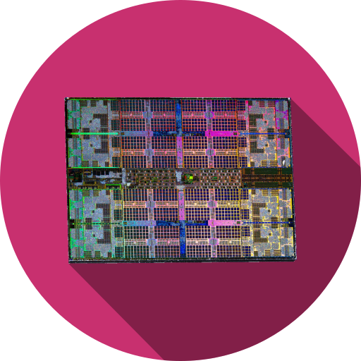

<h1 align="center">
  <br>
  
  <br>
  Hevs CAr Laboratories
  <br>
</h1>

<h4 align="center">Labor Files for CAr Laboratories practical sessions <a href="https://cyberlearn.hes-so.ch" target="_blank">Moodle Cyberlearn</a>.</h4>

# Table of contents
<p align="center">
  <a href="#description">Description</a> •
  <a href="#how-to-use">How To Use</a> •
  <a href="#launch">Launch</a> •
  <a href="#credits">Credits</a> •
  <a href="#license">License</a> •
  <a href="#find-us-on">Find us on</a>
</p>

## Description
[(Back to top)](#table-of-contents)

### Documentation
The documentation is available under the [car-docs](https://github.com/hei-isc-car/car-docs) Git repository.

### Moodle
As it changes each year, all you have to do is search on <a href="https://cyberlearn.hes-so.ch" target="_blank">Moodle Cyberlearn</a> for the course and select the one starting with the last two digits of the current year.

Course number:
* YY_HES-SO-VS_Architecture des ordinateurs / Computerarchitektur

### HEIRV32-MC
The HEIRV32-MC (MC standing for Multi Cycle) lab intends to recreate the previsouly seen HEIRV32-SC architecture while cutting the system into the five steps of the [RISC-V](https://riscv.org/) pipeline.

It does not meet the minimum requirements for the [RV32I ISA](https://riscv.org/wp-content/uploads/2017/05/riscv-spec-v2.2.pdf), but is simpler to implement and support the following instructions :
- R-type (op rd rs1 rs2)
  - add  : rd = rs1 + rs2
  - sub  : rd = rs1 - rs2
  - slt  : rd = (rs1 < rs2) ? 1:0
  - or   : rd = rs1 | rs2
  - and  : rd = rs1 & rs2
- (opt) I-type (op rd rs1 imm), imm on 12 bits
  - addi : rd = rs1 + imm
  - slti : rd = (rs1 < imm) ? 1:0
  - ori  : rd = rs1 | imm
  - andi : rd = rs1 & imm
  - lw (op dest imm(rs1)) : dest = Memory\[rs1 + imm\]
- S-type (op rs2 offs(rs1)), offs on 12 bits
  - sw   : Memory\[rs1 + offs\] = rs2
- B-type (op rs1 rs2 imm]), imm given on 12 bits that will be << 1
  - beq  : if(rs1 == rs2) -> PC += imm
- (opt) J-type (op imm || op rd imm), imm given on 20 bits that will be << 1
  - jal  : rd = PC + 4 (if no rd specified, rd = x1); PC += imm

Code can be written for it through its dedicated assembler (see inside the **heivr32-asm** folder).

## How To Use
[(Back to top)](#table-of-contents)

To clone this template, you'll need [Git](https://git-scm.com). You can also opt for the archive version.
[HDL Designer](https://www.mentor.com/products/fpga/hdl_design/hdl_designer_series/), [Modelsim](https://www.mentor.com/products/fv/modelsim/) and [ISE 14.7](https://www.xilinx.com/support/download/index.html/content/xilinx/en/downloadNav/vivado-design-tools/archive-ise.html) must be installed on your computer. See the [wiki](https://wiki.hevs.ch/fsi/index.php5/Tools/EDA/Install) for help.

The use of the assembler is explained inside the **heirv32-asm** folder.

Finally, the doc can be found inside the **doc** folder.

### Launch
```bash
# Clone this repository including submodules
git clone <repo_url>

# Go into the repository
cd car-labs

# Run the app
## Linux
./car-labs.bash

## Windows
.\car-labs.bat
```

## Credits
[(Back to top)](#table-of-contents)
* COF
* PRC
* ZAS
* AMA

## License
[(Back to top)](#table-of-contents)

:copyright: [All rights reserved](LICENSE)

---

## Find us on
> [hevs.ch](https://www.hevs.ch) &nbsp;&middot;&nbsp;
> Facebook [@hessovalais](https://www.facebook.com/hessovalais) &nbsp;&middot;&nbsp;
> Twitter [@hessovalais](https://twitter.com/hessovalais) &nbsp;&middot;&nbsp;
> LinkedIn [HES-SO Valais-Wallis](https://www.linkedin.com/groups/104343/) &nbsp;&middot;&nbsp;
> Google+ [HES-SO Valais Wallis](https://plus.google.com/105282401140539059594) &nbsp;&middot;&nbsp;
> Youtube [HES-SO Valais-Wallis](https://www.youtube.com/user/HESSOVS)
